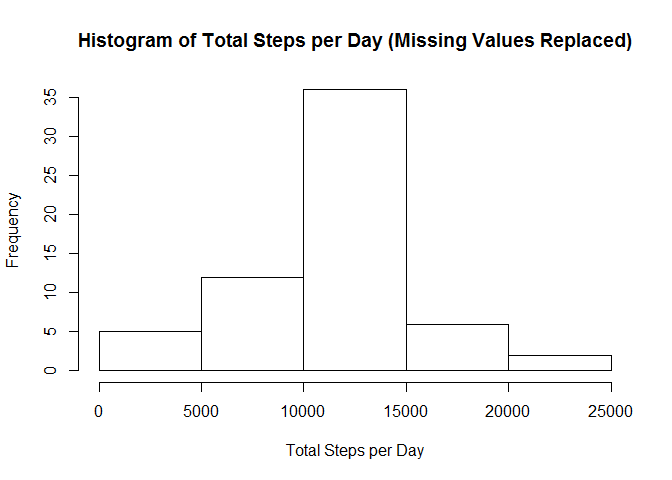

# Reproducible Research: Peer Assessment 1


## Loading and preprocessing the data
First load the libraries needed in this assessment


```r
library(dplyr)
```

```
## 
## Attaching package: 'dplyr'
## 
## The following objects are masked from 'package:stats':
## 
##     filter, lag
## 
## The following objects are masked from 'package:base':
## 
##     intersect, setdiff, setequal, union
```

```r
library(lubridate)
library(lattice)
```

Read in the data set and remove the rows with steps=NA


```r
activity <- read.csv("./activity.csv")
activity2 <- filter(activity,is.na(steps)==FALSE)
```


## What is mean total number of steps taken per day?

Calculate the total number of steps each day and produce a histogram
of the results


```r
activity2 <- group_by(activity2,date)
act_per_day <- summarize(activity2,steps_per_day = sum(steps))
hist(act_per_day$steps_per_day)
```

 

Calculate and report the mean and median of the total number of steps taken per day


```r
mean(act_per_day$steps_per_day)
```

```
## [1] 10766.19
```

```r
median(act_per_day$steps_per_day)
```

```
## [1] 10765
```


## What is the average daily activity pattern?
Make a time series plot of the 5-minute interval (x-axis) and the average number of steps taken, averaged across all days (y-axis)


```r
activity3 <- filter(activity,is.na(steps)==FALSE)
activity3 <- group_by(activity3,interval)
act_by_time <- summarize(activity3,steps_by_time = mean(steps))
plot(act_by_time,type="l")
```

 

Which 5-minute interval, on average across all the days in the dataset, contains the maximum number of steps?


```r
act_by_time$interval[act_by_time$steps_by_time==max(act_by_time$steps_by_time)]
```

```
## [1] 835
```


## Imputing missing values

Calculate and report the total number of missing values in the dataset 


```r
activity_na <- filter(activity,is.na(steps)==TRUE)
activity_good <- filter(activity,is.na(steps)==FALSE)
nrow(activity_na)
```

```
## [1] 2304
```

Fill in the missing values by setting them equal to the mean for that 5 minute period over all days


```r
activity_na <- left_join(activity_na,act_by_time,by="interval")
activity_na$steps <- round(activity_na$steps_by_time)
```

Create a new dataset that is equal to the original dataset but with the missing data filled in.


```r
activity_na <- select(activity_na,-steps_by_time)
activity_na$steps <- as.integer(activity_na$steps)
activity_na$interval <- as.integer(activity_na$interval)
activity_all <- rbind(activity_na,activity_good)
activity_all <- arrange(activity_all,date,interval)
```

Make a histogram of the total number of steps taken each day.


```r
activity_all <- group_by(activity_all,date)
act_per_day2 <- summarize(activity_all,steps_per_day = sum(steps))
hist(act_per_day2$steps_per_day)
```

 

Calculate and report the mean and median total number of steps taken per day.


```r
mean(act_per_day2$steps_per_day)
```

```
## [1] 10765.64
```

```r
median(act_per_day2$steps_per_day)
```

```
## [1] 10762
```

Calculate the impact of imputing missing data on the estimates of the total daily number of steps by comparing with the previous means and medians we calculated.


```r
mean(act_per_day2$steps_per_day) - mean(act_per_day$steps_per_day)
```

```
## [1] -0.549335
```

```r
median(act_per_day2$steps_per_day) - median(act_per_day$steps_per_day)
```

```
## [1] -3
```

## Are there differences in activity patterns between weekdays and weekends?

Create a new factor variable in the dataset with two levels - "weekday" and "weekend" indicating whether a given date is a weekday or weekend day.


```r
activity_all$date <- ymd(activity_all$date)
activity_all$day <- weekdays(activity_all$date)
activity_all$weekend[activity_all$day == "Saturday" | activity_all$day == "Sunday"] = "weekend"
activity_all$weekend[is.na(activity_all$weekend) == TRUE] <- "weekday"
```

Make a panel plot containing a time series plot of the 5-minute interval (x-axis) and the average number of steps taken, averaged across all weekday days or weekend days (y-axis). 


```r
activity_all <- group_by(activity_all,interval,weekend)
activity_weekend <- summarize(activity_all,steps = mean(steps))
xyplot(steps~interval|weekend,activity_weekend,type="l")
```

 

